# Library Management System


A modern web application for managing books, categories, tags, loans, and reviews in a library setting.

## Features

- **Book Management**
  - Add, edit, and delete books
  - Categorize books with multiple categories and tags
  - Upload cover images (via URL)
  - Track publication dates and ISBNs

- **Loan System**
  - Check books in/out
  - Track due dates and returns
  - View active and overdue loans
  - Manage borrower information

- **Review System**
  - 5-star rating system
  - User comments and feedback
  - Edit/delete reviews (authorized users only)

- **User Management**
  - User profiles
  - Secure authentication
  - Role-based permissions

## Technologies Used

- **Backend**
  - PHP 8.1+
  - Laravel 12.x
  - MySQL 8.0+

- **Frontend**
  - Tailwind CSS 3.x
  - Alpine.js (for interactive elements)
  - HTML5, CSS3, JavaScript (ES6)
  - Boxicons

- **Other Tools**
  - Composer (Dependency Management)
  - npm (Frontend Assets)
  - Git (Version Control)

## Installation

1. **Clone the repository**
   ```bash
   git clone https://github.com/isidorejad/library-hub.git
   cd library-management-system
   ```

2. **Install dependencies**
   ```bash
   composer install
   npm install
   ```

3. **Configure environment**
   - Copy `.env.example` to `.env`
   - Update database credentials in `.env`
   - Generate application key:
     ```bash
     php artisan key:generate
     ```

4. **Database setup**
   ```bash
   php artisan migrate --seed
   ```

5. **Compile assets**
   ```bash
   npm run build
   ```

6. **Start development server**
   ```bash
   php artisan serve
   ```

## Configuration

### Environment Variables

Key variables to configure in `.env`:

```ini
APP_NAME="Library Hub"
APP_ENV=local
APP_KEY=
APP_DEBUG=true
APP_URL=http://localhost:8000

DB_CONNECTION=mysql
DB_HOST=127.0.0.1
DB_PORT=3306
DB_DATABASE=library-hubdb
DB_USERNAME=root
DB_PASSWORD=

MAIL_MAILER=smtp
MAIL_HOST=mailhog
MAIL_PORT=1025
MAIL_USERNAME=null
MAIL_PASSWORD=null
MAIL_ENCRYPTION=null
MAIL_FROM_ADDRESS="no-reply@libraryhub.com"
MAIL_FROM_NAME="${APP_NAME}"
```

## Usage

### Default Admin Account
After seeding:
- Email: admin@library.com
- Password: password

### Key Routes
- `/dashboard` - Admin dashboard
- `/books` - Book management
- `/categories` - Category management
- `/tags` - Tag management
- `/loans` - Loan tracking
- `/profile` - User profile

## API Endpoints

The application provides a RESTful API for integration:

| Endpoint | Method | Description |
|----------|--------|-------------|
| `/api/books` | GET | List all books |
| `/api/books` | POST | Create new book |
| `/api/books/{id}` | GET | Get specific book |
| `/api/books/{id}` | PUT | Update book |
| `/api/books/{id}` | DELETE | Delete book |
| `/api/loans` | GET | List all loans |
| `/api/reviews` | POST | Create new review |

## Testing

Run tests with:
```bash
php artisan test
```

Test coverage includes:
- Book CRUD operations
- Loan management
- Review validation
- User authentication

## Deployment

For production deployment:

1. Set up a web server (Nginx/Apache)
2. Configure database for production
3. Update `.env` with production values
4. Optimize the application:
   ```bash
   php artisan config:cache
   php artisan route:cache
   php artisan view:cache
   ```

## 📸 Screenshots

### 🔐 Login Page  
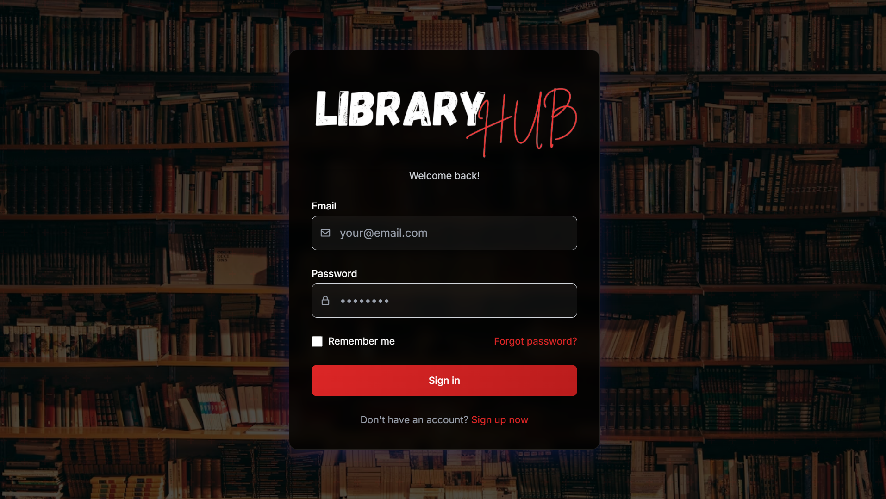  
*User authentication screen*

### 📝 Register Page  
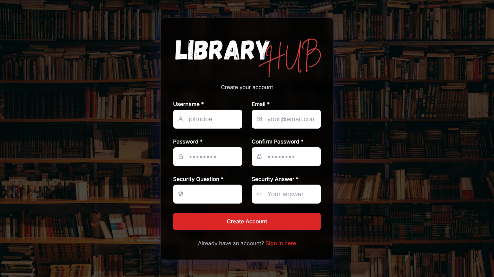  
*User registration form*

### 🏠 Home  
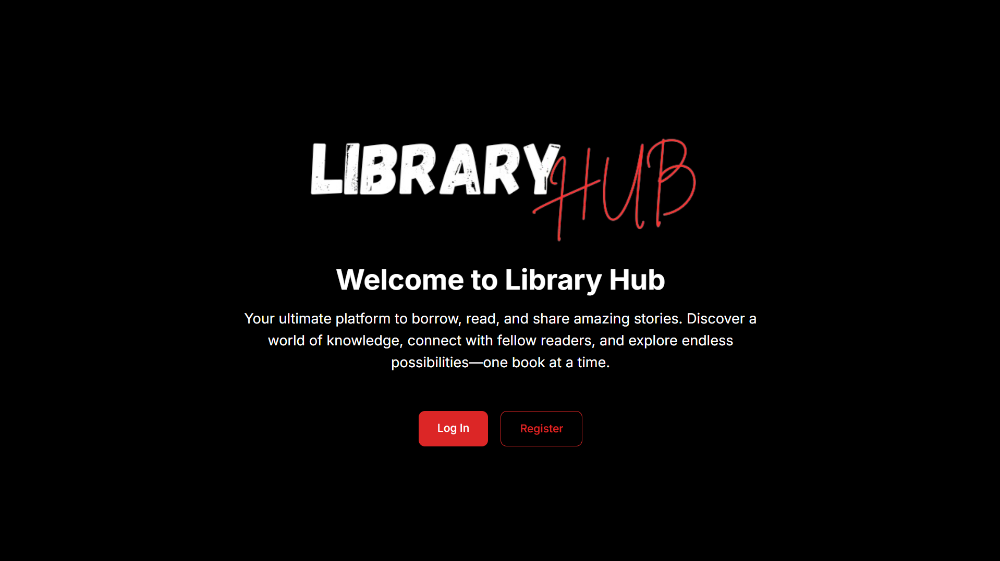  
*Landing page after login*

### 📊 Dashboard  
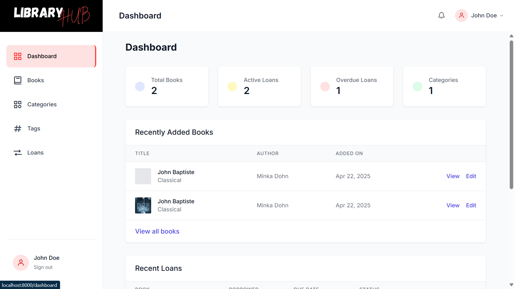  
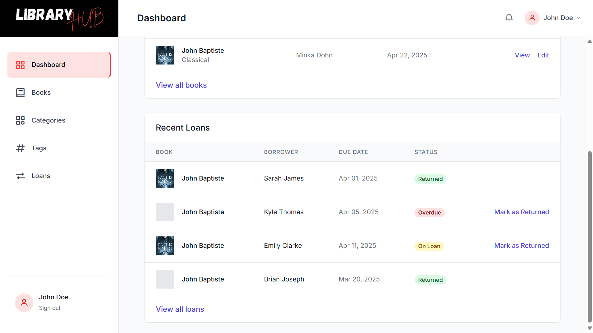  
*Admin/user dashboard views*

### 📚 Book Management  
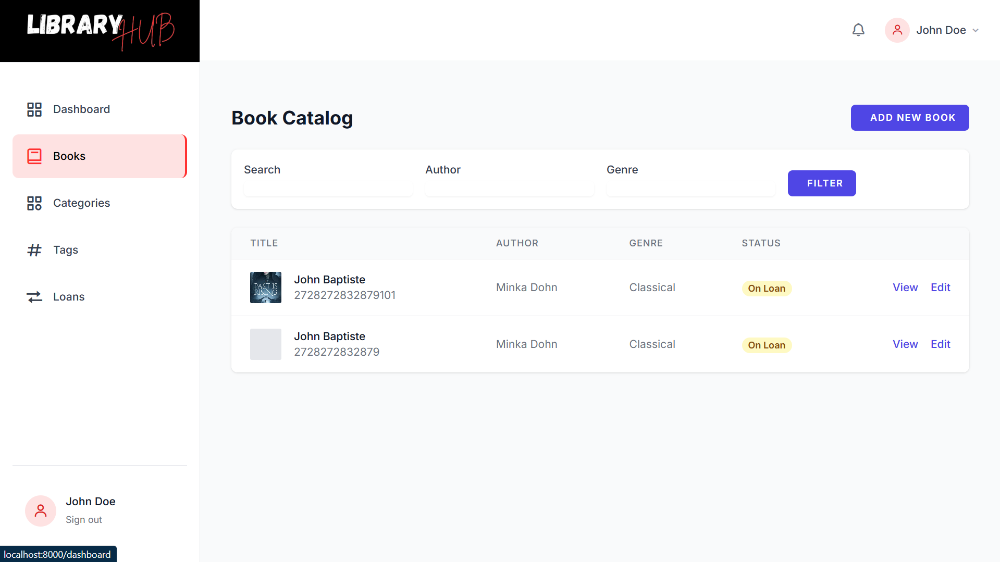  
*Add, edit, or remove books*

### 🏷️ Category Management  
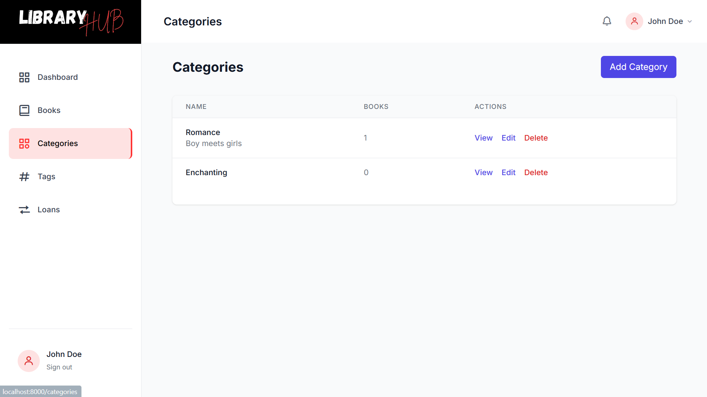  
*Manage book categories*

### 🔖 Tag Management  
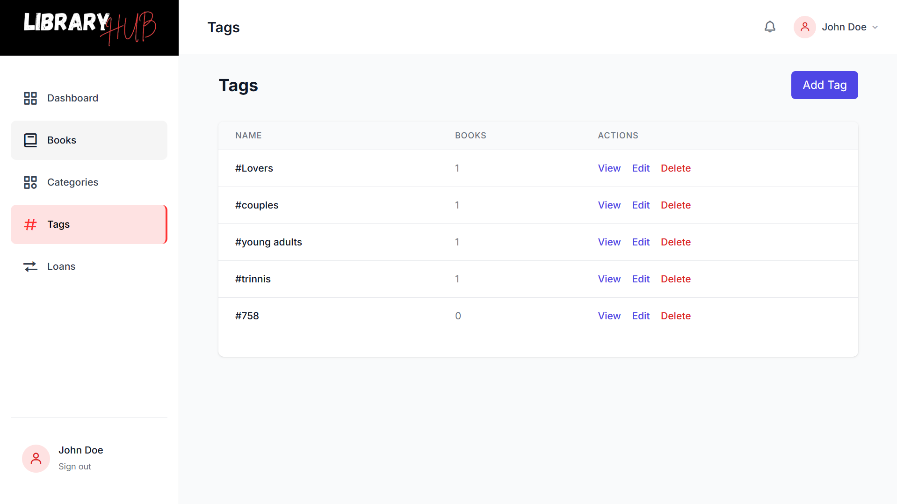  
*Tagging system for organizing books*

### 📥 Loan System  
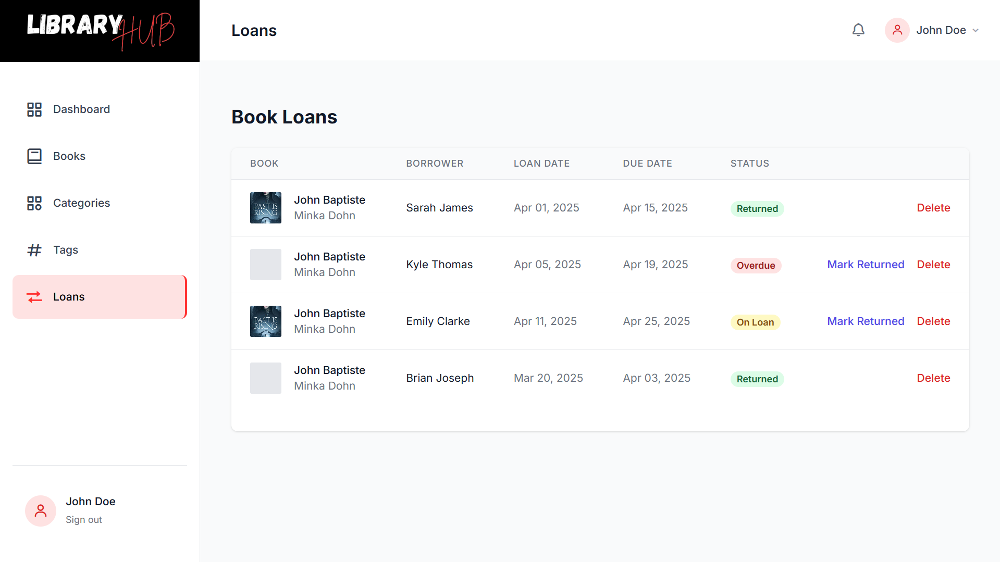  
*Loan books to users*

### 👤 Profile Page  
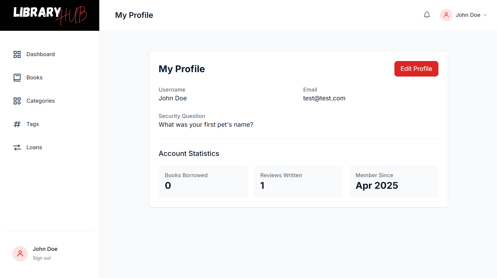  
*User profile overview*

### 🔄 Update Profile  
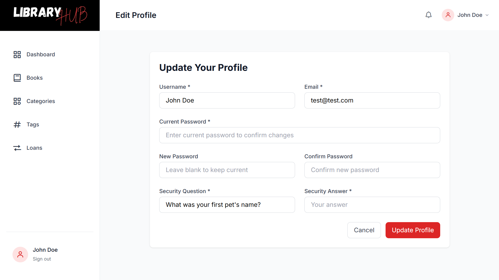  
*Edit user information*


## Contributing

1. Fork the project
2. Create your feature branch (`git checkout -b feature/AmazingFeature`)
3. Commit your changes (`git commit -m 'Add some AmazingFeature'`)
4. Push to the branch (`git push origin feature/AmazingFeature`)
5. Open a Pull Request

## License

Distributed under the MIT License. See `LICENSE` for more information.

## Contact

Project Maintainer - [Jad Isidore](mailto:isidorejad@gmail.com)

Project Link: [https://github.com/isidorejad/library-hub](https://github.com/isidorejad/library-hub)
